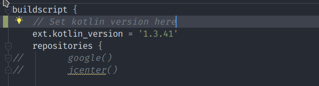

# hello_world

A new Flutter application.

## Getting Started

This project is a starting point for a Flutter application.

A few resources to get you started if this is your first Flutter project:

- [Lab: Write your first Flutter app](https://flutter.dev/docs/get-started/codelab)
- [Cookbook: Useful Flutter samples](https://flutter.dev/docs/cookbook)

For help getting started with Flutter, view our
[online documentation](https://flutter.dev/docs), which offers tutorials,
samples, guidance on mobile development, and a full API reference.

## Run

Follow this instruction and do further modification in

[What’s the difference](#What's\ the\ difference?) section.

## What’s the difference? 

This Hello World is specifically modified to adapt Chinese network environment and current package version.

### Aliyun mirrors(for project)

Modify `android/build.gradle`to access google and jcenter repo in mainland.

```groovy
buildscript {
    ext.kotlin_version = '1.3.41'
    repositories {
    //MODIFY HERE
//        google()
//        jcenter()

        maven { url 'https://maven.aliyun.com/repository/google' }
        maven { url 'https://maven.aliyun.com/repository/jcenter' }
        maven{ url 'http://maven.aliyun.com/nexus/content/groups/public/'}
    }

    dependencies {
        classpath 'com.android.tools.build:gradle:3.5.0'
        classpath "org.jetbrains.kotlin:kotlin-gradle-plugin:$kotlin_version"
    }
}

allprojects {
    repositories {
    //MODIFY HERE
//        google()
//        jcenter()

        maven { url 'https://maven.aliyun.com/repository/google' }
        maven { url 'https://maven.aliyun.com/repository/jcenter' }
        maven{ url 'http://maven.aliyun.com/nexus/content/groups/public/'}
    }
}
```


### Correct Gradle Version

Modify `android/gradle/wrapper/gradle-wrapper.properties`

```bash
#Fri Jun 23 08:50:38 CEST 2017
distributionBase=GRADLE_USER_HOME
distributionPath=wrapper/dists
zipStoreBase=GRADLE_USER_HOME
zipStorePath=wrapper/dists
distributionUrl=https\://services.gradle.org/distributions/gradle-5.4.1-all.zip
# Modify the last gradle version(5.4.1 here)
```


### Newer Kotlin Version

Modify `android/build.gradle`.



### Aliyun mirrors(for Flutter SDK)

Modify`${YOUR_FLUTTER_PATH}/flutter/packages/flutter_tools/gradle/flutter.gradle`

Basically the same as `build.gradle` in project.

```groovy
buildscript {
    repositories {
        // google()
        // jcenter()
        maven { url 'https://maven.aliyun.com/repository/google' }
        maven { url 'https://maven.aliyun.com/repository/jcenter' }
        maven { url 'http://maven.aliyun.com/nexus/content/groups/public' }
    }
    dependencies {
        classpath 'com.android.tools.build:gradle:3.2.1'
    }
}
```


